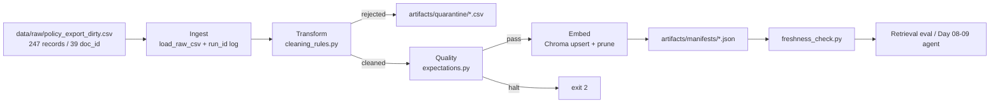

# Kiến trúc pipeline — Lab Day 10

**Nhóm:** Nguyễn Thành Tài  
**Cập nhật:** 2026-06-10

---

## 1. Sơ đồ luồng

**Điểm đo freshness:** sau khi ghi manifest (`latest_exported_at`, `run_timestamp`).  
**run_id:** ghi trong log `artifacts/logs/run_<run-id>.log`, manifest JSON, metadata Chroma.

---

## 2. Ranh giới trách nhiệm

| Thành phần | Input                     | Output                              | Owner nhóm       |
| ---------- | ------------------------- | ----------------------------------- | ---------------- |
| Ingest     | `policy_export_dirty.csv` | raw rows + log counts               | Nguyen Thanh Tai |
| Transform  | raw rows                  | `cleaned_*.csv`, `quarantine_*.csv` | Nguyen Thanh Tai |
| Quality    | cleaned rows              | expectation results, halt/ok        | Nguyen Thanh Tai |
| Embed      | cleaned CSV               | Chroma collection `day10_kb`        | Nguyen Thanh Tai |
| Monitor    | manifest JSON             | PASS/WARN/FAIL freshness            | Nguyen Thanh Tai |

---

## 3. Idempotency & rerun

- Embed dùng **upsert theo `chunk_id`** — rerun cùng dữ liệu không nhân đôi vector.
- Sau mỗi publish, **prune** các `chunk_id` cũ không còn trong cleaned snapshot (`embed_prune_removed` trong log).
- Rerun `python etl_pipeline.py run` 2 lần: `cleaned_records` và collection size ổn định (44 chunks).

---

## 4. Liên hệ Day 09

Pipeline Day 10 xử lý **export CSV bẩn** (mô phỏng ingest từ 5 hệ thống nguồn) thay vì đọc trực tiếp `data/docs/`. Corpus canonical trong `data/docs/` là source of truth; CSV là bản export có lỗi thực tế (duplicate, stale version, doc_id lạ).

Collection Chroma tách riêng `day10_kb` (không ghi đè Day 09) để tránh vector cũ làm nhiễu eval. Day 09 agent có thể trỏ sang collection này sau khi pipeline pass freshness + grading.

---

## 5. Rủi ro đã biết

- Embedding model `all-MiniLM-L6-v2` có thể rank chunk P2 SLA cao hơn chunk escalation P1 — đã mitigate bằng rule enrich escalation vào chunk P1.
- `exported_at` từng có format `2026/04/07` (slash) — đã normalize sang ISO-like trong clean step.
- Freshness WARN nếu manifest thiếu timestamp parse được — đã giảm bằng normalize `exported_at`.

